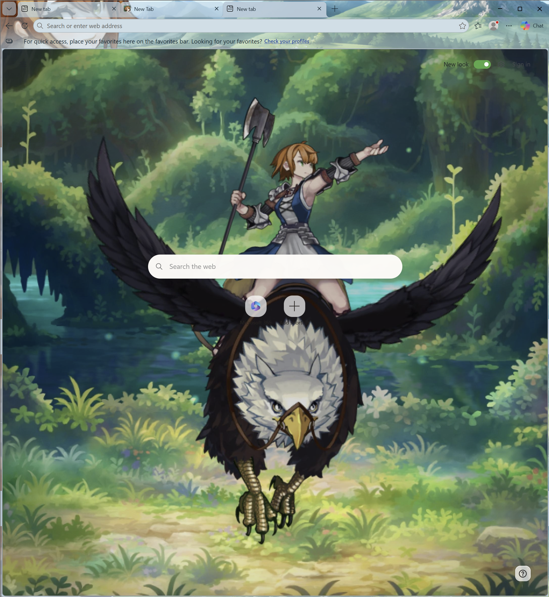
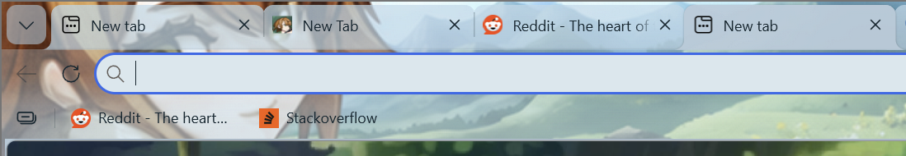

# Fran, Sky Blue

A theme dedicated to Fran from Unicorn Overlord, with translucent-style tabs, a light blue toolbar, and support for 4K displays.

## [↓ Download for Microsoft Edge (.zip)](https://github.com/drcgrp/Fran-Unicorn-Overlord-Theme-Edge/raw/refs/heads/main/downloads/fran-sky-blue.zip)

**[Installation instructions](#install-in-microsoft-edge)** · [SHA-256 checksum](downloads/fran-sky-blue.zip.sha256)

## Screenshots

The full browser window, with the forest wallpaper and sky-blue toolbar:



A closer look at Fran's eyes behind the translucent-style tabs:



Fran and the landscape extend across the browser header. The open area beside the tabs keeps the original artwork, while the tabs and toolbar use a blue wash for readability. The wash strengthens behind the bookmarks bar. The new-tab wallpaper shows Fran riding a griffon through a forest.

## Install in Microsoft Edge

1. **[Download fran-sky-blue.zip](https://github.com/drcgrp/Fran-Unicorn-Overlord-Theme-Edge/raw/refs/heads/main/downloads/fran-sky-blue.zip).**
2. Extract it into a folder you will keep on your computer.
3. Open `edge://extensions` and turn on **Developer mode**.
4. Choose **Load unpacked** and select the extracted folder containing `manifest.json`.

You can also load the `theme/` folder from this repository directly. After replacing files with a newer release, reload the theme on the extensions page or load the folder again.

This is a native static theme. The installed package contains only a manifest and six images: no executable scripts, requested permissions, website access, or data collection. Microsoft Edge Add-ons rejected the theme manifest, so this repository distributes it for local installation.

## Supported layout and limits

- The artwork is tuned for Edge's horizontal tabs on Windows, using the 150% display-scaling setup it was developed with. Other scaling settings and browser layouts may align differently. Chrome is not a supported target.
- Header images are 4095 pixels wide and stay anchored on the left. Browser theme images have a fixed size; Edge may repeat the header beyond that width.
- The wallpaper is exported at 2560 × 1440 from a 3840 × 2160 source. Display support does not mean every packaged image is native 4K.
- The new-tab wallpaper requests [horizontal centering with top alignment](https://chromium.googlesource.com/chromium/src.git/+/c31b72bcf79c48426d3854abd5c4ee5f16abf752/docs/theme_creation_guide.md#ntp_background_alignment), so a narrower window crops the forest on both sides of Fran. Edge controls the final sizing, and its new-tab settings can override the theme background. Search-box position and other new-tab widgets are controlled by Edge.
- The translucent appearance is baked into the images. A theme cannot add live blur, custom tab borders or shadows, change native fonts or tab heights, or style websites.

## Build and package

Use Node.js 22 or newer:

```sh
npm ci
npm run build
npm run validate
npm run package
```

`assets/header.png` and `assets/wallpaper.jpg` are the source artwork. The build produces the six images in `theme/images/`; the manifest is maintained in `theme/manifest.json`.

Validation checks the package allowlist, manifest, image dimensions, and PNG metadata. Packaging writes `dist/fran-sky-blue.zip` and its SHA-256 checksum. The ZIP contains only the seven installable theme files, with fixed archive timestamps and no build tools or source artwork.

`downloads/` contains the ready-to-install ZIP linked above. When the theme changes, rebuild the package and copy the ZIP and checksum from `dist/` into `downloads/`. README screenshots stay outside the installable package.

## Releases

Release tags and titles use the source commit's short hash. The numeric version in the theme manifest is kept separately because browser manifests require a numeric version. It does not need to change for documentation or packaging-only commits.

This is an unofficial fan theme based on Fran from Unicorn Overlord. No blanket license to the character or artwork is granted by this repository.
